<p align="center">
  
</p>

<p align="center">
  <a href="#running-locally"></a>
  <a href="https://github.com/itaygoldenberg/nutrition-ai"></a>
  <a href="https://github.com/itaygoldenberg?tab=repositories"></a>
  <a href="https://www.linkedin.com/in/itay-goldenberg/"></a>
</p>

<p align="center">
  <a href="#overview">Overview</a>&nbsp;&middot;&nbsp;
  <a href="#features">Features</a>&nbsp;&middot;&nbsp;
  <a href="#workflow">Workflow</a>&nbsp;&middot;&nbsp;
  <a href="#technology">Technology</a>&nbsp;&middot;&nbsp;
  <a href="#running-locally">Running locally</a>
</p>

> [!NOTE]
> A full-stack course portfolio project by Itay Goldenberg. Generate a structured daily meal plan in Hebrew and English.

## Overview

Nutrition AI collects age, height, weight and diet type in a React form, then requests a daily meal plan from OpenAI. The prompt asks for paired Hebrew and English fields for the title, breakfast, lunch, dinner, hydration, tips and warnings.

The service parses the response into the MealPlanModel shape so the interface can render separate sections and switch languages instead of displaying a single block of prose.

<table><tr><td align="center" width="25%"><strong>4 INPUTS</strong><br /><sub>personal details</sub></td><td align="center" width="25%"><strong>2 LANGUAGES</strong><br /><sub>Hebrew and English</sub></td><td align="center" width="25%"><strong>6 SECTIONS</strong><br /><sub>meals and guidance</sub></td><td align="center" width="25%"><strong>JSON</strong><br /><sub>structured response</sub></td></tr></table>

| Project detail | Implementation |
|---|---|
| React + TypeScript | Form and result components |
| react-hook-form | Input handling |
| Axios + OpenAI | Completion request |
| Vite + CSS | Development and presentation |

## Contents

- [Overview](#overview)
- [Features](#features)
- [Workflow](#workflow)
- [Technology](#technology)
- [Project structure](#project-structure)
- [Running locally](#running-locally)
- [Checks](#checks)
- [Additional details](#additional-details)
- [Operational notes](#operational-notes)
- [Author](#author)

## Features

### Personalized request

Age, height, weight and diet type are included in the meal-plan prompt.

### Bilingual result fields

The requested JSON contains parallel `_he` and `_en` fields for each section.

### Section-based rendering

Meal arrays are rendered as individual items, keeping meals, hydration, tips and warnings distinct.

### Separated model service

The HTTP completion request is isolated in `src/services/gpt.ts`; NutritionService constructs the nutrition-specific prompt.

## Workflow

<p align="center">
  
</p>

1. **DETAILS FORM:** Age, height, weight and diet type.
2. **NUTRITION PROMPT:** Request paired Hebrew / English fields.
3. **OPENAI RESPONSE:** Parse the returned JSON meal plan.
4. **RESULT SECTIONS:** Render meals, water tips and warnings.

## Technology

<p align="center">
  
</p>

| Technology | Role |
|---|---|
| React + TypeScript | Form and result components |
| react-hook-form | Input handling |
| Axios + OpenAI | Completion request |
| Vite + CSS | Development and presentation |

## Project structure

```text
src/components/nutrition-area/  Diet advisor form and result
src/components/meal-selection/ Meal section rendering
src/models/                   User and meal-plan contracts
src/services/                 GPT transport and nutrition prompt
src/utils/                    Application configuration
docs/                         README artwork
```

## Running locally

Clone the repository, then follow the application-specific steps below. Commands assume the repository root unless a directory change is shown.

```bash
git clone https://github.com/itaygoldenberg/nutrition-ai.git
cd nutrition-ai
```

Copy `.env.example` to `.env` in this application directory and configure it before starting:

```env
VITE_OPENAI_API_KEY=your_openai_api_key
```

```bash
npm install
npm run dev
```

Open the local address printed by Vite. Restart Vite after changing `.env`.

## Checks

Run `npm run build`. With a local API key, submit complete details, inspect all result sections, and switch between Hebrew and English. Check a narrow screen and the failed-request state. Live generation consumes API usage.

These are available build commands and suggested manual checks, not a claim that a full integration test suite is included.

## Additional details

The response contains `title_en` / `title_he`, plus array pairs for `breakfast`, `lunch`, `dinner`, `hydration`, `tips` and `warnings`. TypeScript describes the shape; `JSON.parse` does not perform runtime schema validation.

## Operational notes

The OpenAI key is read from a `VITE_` variable and is visible in the browser bundle. This implementation is a local learning exercise; public hosting requires moving authenticated model calls to a server. Generated output is parsed as JSON, so malformed model responses can fail at runtime. This project generates educational meal suggestions and is not a clinically validated nutrition service.

## Author

<p align="center">
  <strong>Itay Goldenberg</strong><br />
  <sub>Full Stack Developer Student &middot; John Bryce</sub>
</p>

<p align="center">
  <a href="https://github.com/itaygoldenberg"></a>
  <a href="https://www.linkedin.com/in/itay-goldenberg/"></a>
</p>
