<p align="center">
  
</p>

<p align="center">
  <a href="#running-it"></a>
  <a href="https://github.com/itaygoldenberg/nutrition-ai"></a>
  <a href="https://github.com/itaygoldenberg?tab=repositories"></a>
  <a href="https://www.linkedin.com/in/itay-goldenberg/"></a>
</p>

> [!NOTE]
> A React client that turns a description of you and your goal into a meal plan the interface can actually lay out.

<p align="center">
  <a href="#overview">Overview</a>&nbsp;&middot;&nbsp;
  <a href="#features">Features</a>&nbsp;&middot;&nbsp;
  <a href="#technology">Technology</a>&nbsp;&middot;&nbsp;
  <a href="#project-structure">Project structure</a>&nbsp;&middot;&nbsp;
  <a href="#running-it">Running it</a>&nbsp;&middot;&nbsp;
  <a href="#notes">Notes</a>
</p>

## Overview

A form collects your details and what you are aiming for. The model returns a plan shaped to them, and the app renders it as structure rather than as a paragraph.

The part that makes that possible is typing the answer. `meal-plan-model` describes the shape the reply has to come back in, so the response arrives as data the components can iterate over instead of as a string the interface has to guess at.

| Project detail | Implementation |
|---|---|
| Frontend | React, TypeScript and Vite |
| Input | react-hook-form, validated before anything is sent |
| Typed request | `models/user-details.ts` |
| Typed response | `models/meal-plan-model.ts` |
| Model | OpenAI, reached through `services/gpt.ts` |
| Mapping | `services/nutrition-service.ts` turns the reply into the model |

## Contents

- [Overview](#overview)
- [Features](#features)
- [Technology](#technology)
- [Project structure](#project-structure)
- [Running it](#running-it)
- [Notes](#notes)

## Features

### A plan built for the input

The details go into the prompt, so the result is shaped to the goal rather than being a generic list.

### Typing the answer, not only the request

Without a model for the response the reply is a string and the interface has nothing to lay out. Describing the expected shape is what makes the plan renderable.

### Validation before the call

react-hook-form rejects an incomplete form in the browser, so a malformed request never costs a round trip.

### One place that talks to the model

`services/gpt.ts` holds the endpoint and the request shape. Nothing else in the app knows the model exists.

## Technology

<p align="center">
  
</p>

| Technology | Role |
|---|---|
| React + TypeScript | Typed single page application |
| react-hook-form | Form state and validation |
| Axios | HTTP client |
| OpenAI | Generates the plan |
| Vite | Build tooling |
| Lucide + Font Awesome | Iconography |

## Project structure

```text
Nutrition AI/
|-- src/
|   |-- components/
|   |   |-- layout-area/
|   |   |-- meal-selection/
|   |   `-- nutrition-area/
|   |-- models/
|   |   |-- user-details.ts      what the form collects
|   |   `-- meal-plan-model.ts   the shape the answer must take
|   |-- services/
|   |   |-- gpt.ts               the only file that calls the model
|   |   `-- nutrition-service.ts
|   `-- utils/
`-- docs/                        README artwork only
```

## Running it

```bash
npm install
```

```bash
npm run dev
```

## Environment

Copy `.env.example` to `.env` and fill in your own values:

```env
VITE_OPENAI_API_KEY=your_openai_api_key
```

`.env` is ignored by git. A key that reaches GitHub is public from the moment it is pushed.

## Notes

- A `VITE_` variable is bundled into the client and visible to anyone who opens the browser tools. Acceptable for a local exercise; a deployed version needs a server between the browser and the model.
- The plan is only as good as the shape it is asked for. Loosening `meal-plan-model` produces prose, and the interface stops being able to render it.

## Author

<p align="center">
  <strong>Itay Goldenberg</strong><br />
  <sub>Full Stack Developer Student &middot; John Bryce</sub>
</p>

<p align="center">
  <a href="https://github.com/itaygoldenberg"></a>
  <a href="https://www.linkedin.com/in/itay-goldenberg/"></a>
</p>
